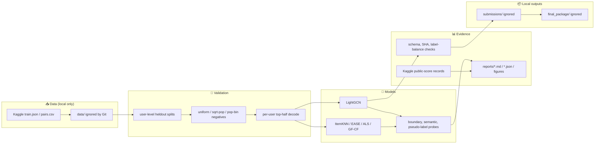

[English](README.md) | 한국어

<div align="center">

# 🎮 KMU RecSys 26 Steam

### LightGCN, 검증 리포트, 재현 패키지로 정리한 Kaggle Steam 플레이 예측 파이프라인

*원본 Kaggle 데이터와 제출 CSV는 로컬에만 두고, 공개 가능한 코드·리포트·검증 기록만 남긴 추천시스템 대회 작업 저장소입니다.*

<p>
  
  
  
  
  
</p>

<p>
  
  
  
  
  
  
</p>

</div>

---

## 📑 목차

- [🧭 소개](#-소개)
- [🎯 핵심 결과](#-핵심-결과)
- [🏗 아키텍처](#-아키텍처)
- [🛠 기술 스택](#-기술-스택)
- [🗂 프로젝트 구조](#-프로젝트-구조)
- [🚀 빠른 시작](#-빠른-시작)
- [📝 재현 방법](#-재현-방법)
- [🔒 공개 안전성](#-공개-안전성)
- [👤 작성자](#-작성자)

## 🧭 소개

이 저장소는 Kaggle [`kmu-rec-sys-26-steam`](https://www.kaggle.com/competitions/kmu-rec-sys-26-steam) 대회 작업을 정리한 공간입니다. 주어진 `userID, gameID` 쌍에 대해 해당 사용자가 그 게임을 플레이했는지 예측하는 이진 추천 문제를 다룹니다.

> TL;DR — Public 최고 점수는 emb128·emb192 LightGCN 계열 rank blend가 냈고, 재현 안정성은 emb128 LightGCN 4-seed 앙상블이 가장 좋았습니다.

Git에는 공개해도 되는 자료만 남겼습니다. 소스 코드, 검증 스크립트, 실험 리포트, 일부 그림, 재현성 기록은 추적하지만, 원본 Kaggle 파일, score matrix, W&B local run, 최종 제출 CSV, credential은 올리지 않습니다.

## 🎯 핵심 결과

| 슬롯 / 역할 | 후보 | Public score | Rows | SHA256 | 근거 |
|---|---|---:|---:|---|---|
| **Final slot 1 / public-best 보존** | **Rank blend: emb128 + emb192** | **0.77825** | **19,998** | `1d38c3ed…` | [`final_slot1` 리포트](reports/20260612T2308KST_final_slot1_kaggle_submission_result.md) |
| Final slot 2 / 안정형 backbone | LightGCN emb128 L4 reg1e-3, 4 seeds | 0.77745 | 19,998 | `7e3191de…` | [`emb128` 재현 리포트](reports/20260530_ecampus_repro_emb128L4r3_077745.md) |
| 이전 anchor | LightGCN emb64 L3 reg1e-4, 4 seeds | 0.77125 | 19,998 | `dcc578de…` | [`seed ensemble` 리포트](reports/20260530_ecampus_repro_seed_ens_077125.md) |
| 첫 제출 baseline blend | BM25 + EASE + ALS mean-z blend | 0.74594 | 19,998 | `5f93cf1b…` | [`submission` 리포트](reports/20260530T124312KST_submission_analysis.md) |

Rank blend가 Public 점수는 가장 높았지만, 내부 validation margin은 강하지 않았습니다. 그래서 최종 정리에서는 public-best 보존 후보와 byte-identical 재현성이 좋은 emb128 backbone을 나눠 기록했습니다.

## 🏗 아키텍처



이 저장소는 원본 데이터를 보관하는 곳이 아니라 의사결정 기록을 남기는 곳입니다. 로컬 데이터로 validation과 후보 생성을 수행하고, Git에는 어떤 축을 시도했는지, 어떤 gate에서 닫혔는지, Kaggle Public 결과와 재현성 검증이 어땠는지를 남겼습니다.

## 🛠 기술 스택

| 역할 | 사용 도구 |
|---|---|
| 모델링 | PyTorch, LightGCN, ItemKNN, EASE, ALS/WMF, GF-CF 계열 probe |
| 검증 | NumPy, pandas, SciPy, user-level candidate split, per-user top-half decoding |
| 실험 추적 | W&B summary logging, JSON/Markdown audit report |
| 에이전트 리뷰 | OpenCode / Hephaestus, AI-Q research note, 수동 safety gate |
| 패키징 | SHA256 preflight, final-slot report, eCampus 재현 manifest |

## 🗂 프로젝트 구조

```text
kmu-rec-sys-26-steam/
├── README.md / README.ko.md          # 공개용 이중 언어 개요
├── docs/                             # 대회 규칙과 운영 메모
├── scripts/                          # ★ 모델링, 검증, materialization, audit 코드
├── reports/                          # ★ 결과, preflight, 그림, 의사결정 근거
├── state/                            # 자동화 판단을 설명하는 작은 상태 파일
├── data/                             # ignored: 원본 Kaggle 파일
├── artifacts/                        # ignored: score matrix, 모델 출력, seed별 test score
├── submissions/                      # ignored: 생성된 Kaggle CSV
├── final_package/                    # ignored: 외부 제출용 최종 label CSV
├── wandb_runs/                       # ignored: W&B local cache
└── .gitignore                        # 공개 안전장치
```

## 🚀 빠른 시작

먼저 공개 저장소를 clone합니다.

```bash
git clone https://github.com/mrpc2003/kmu-rec-sys-26-steam.git
cd kmu-rec-sys-26-steam
```

대회 데이터는 Kaggle에서 직접 받은 뒤, 스크립트가 기대하는 로컬 ignored 경로에 둡니다. 원본 데이터는 이 저장소에서 재배포하지 않습니다.

```text
data/raw/public/data/train.json
data/raw/public/data/pairs.csv
```

제출 없이 스크립트 CLI만 확인하려면 아래 명령을 실행합니다.

```bash
uv run --with numpy --with pandas --with scipy \
  python scripts/build_validation_splits.py --help
```

## 📝 재현 방법

최종 안정형 backbone은 `scripts/reproduce_submission_emb128.py`로 검증합니다. 기본 `--verify-existing` 모드는 로컬 `artifacts/` 아래 seed별 score 파일을 기대합니다. 이 파일들은 생성 산출물이므로 Git에는 포함하지 않았습니다.

```bash
uv run --with numpy --with pandas --with scipy \
  python scripts/reproduce_submission_emb128.py --verify-existing
```

원본 Kaggle 데이터에서 GPU로 다시 학습하려면 같은 스크립트에 `--from-scratch`를 붙입니다. 네 개 seed를 학습한 뒤 후보 CSV를 다시 만들고, 기대 SHA와 일치하는지 확인합니다.

```bash
uv run --python 3.13 \
  --with torch==2.10.0 --with numpy --with pandas --with scipy \
  python scripts/reproduce_submission_emb128.py --from-scratch --device cuda:0
```

재현 스크립트는 Kaggle 제출을 실행하지 않습니다. 실제 제출은 별도 승인 뒤 진행했고, 결과는 리포트에 기록했습니다.

## 🔒 공개 안전성

이 저장소는 별도 public-readiness audit 뒤 공개했습니다.

- current forbidden prefixes: `0`
- history forbidden prefixes after cleanup: `0`
- credential findings: `0`
- blobs over 100 MB: `0`
- fresh public clone verification: passed

감사 기록은 [`reports/20260616T2352KST_public_readiness_audit.md`](reports/20260616T2352KST_public_readiness_audit.md)에 남겼습니다. 아직 top-level code license는 고르지 않았기 때문에, 공개 열람은 가능하지만 재사용 조건은 명시되어 있지 않습니다.

## 👤 작성자

[@mrpc2003](https://github.com/mrpc2003) — 김우현, 국민대학교 인공지능전공.

<div align="center">

<sub>PyTorch, Kaggle validation discipline, no-submit safety check로 정리한 추천시스템 대회 기록입니다.</sub>

</div>
