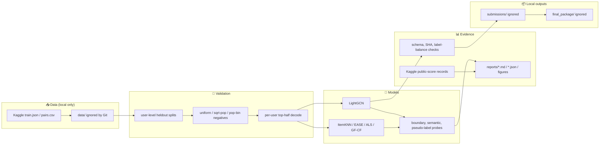

English | [한국어](README.ko.md)

<div align="center">

# 🎮 KMU RecSys 26 Steam

### Kaggle Steam played-prediction pipeline with LightGCN, validation audits, and reproducible reports

*Coursework competition workspace for binary user-game recommendation, keeping code and reports public while raw Kaggle data and submission CSVs stay local.*

<p>
  
  
  
  
  
</p>

<p>
  
  
  
  
  
  
</p>

</div>

---

## 📑 Table of Contents

- [🧭 About](#-about)
- [🎯 Headline Results](#-headline-results)
- [🏗 Architecture](#-architecture)
- [🛠 Tech Stack](#-tech-stack)
- [🗂 Project Structure](#-project-structure)
- [🚀 Quick Start](#-quick-start)
- [📝 Reproducing](#-reproducing)
- [🔒 Public Safety](#-public-safety)
- [👤 Author](#-author)

## 🧭 About

This repository documents my work for Kaggle [`kmu-rec-sys-26-steam`](https://www.kaggle.com/competitions/kmu-rec-sys-26-steam), a binary recommendation task that predicts whether a given `userID, gameID` pair was played.

> TL;DR — The strongest public submission was a normalized rank blend of two LightGCN-family candidates, while the most stable reproducible backbone was an emb128 LightGCN 4-seed ensemble.

Only public-safe material is tracked: source code, validation scripts, audit reports, selected figures, and reproducibility notes. Raw Kaggle files, generated score matrices, W&B local runs, final submission CSVs, and credentials are intentionally excluded.

## 🎯 Headline Results

| Slot / role | Candidate | Public score | Rows | SHA256 | Evidence |
|---|---|---:|---:|---|---|
| **Final slot 1 / public-best preservation** | **Rank blend: emb128 + emb192** | **0.77825** | **19,998** | `1d38c3ed…` | [`final_slot1` report](reports/20260612T2308KST_final_slot1_kaggle_submission_result.md) |
| Final slot 2 / stable backbone | LightGCN emb128 L4 reg1e-3, 4 seeds | 0.77745 | 19,998 | `7e3191de…` | [`emb128` repro report](reports/20260530_ecampus_repro_emb128L4r3_077745.md) |
| Earlier anchor | LightGCN emb64 L3 reg1e-4, 4 seeds | 0.77125 | 19,998 | `dcc578de…` | [`seed ensemble` report](reports/20260530_ecampus_repro_seed_ens_077125.md) |
| First submitted baseline blend | BM25 + EASE + ALS mean-z blend | 0.74594 | 19,998 | `5f93cf1b…` | [`submission` report](reports/20260530T124312KST_submission_analysis.md) |

Important interpretation: the rank-blend row had the best public score, but its internal validation margin was weak. The emb128 LightGCN ensemble stayed as the safer reproducible backbone because its byte-identical regeneration and validation behavior were cleaner.

## 🏗 Architecture



The repository keeps the decision trail in Git, not the raw competition files. Local-only data feeds validation and candidate generation; tracked reports record the tested axes, failed gates, public-score outcomes, and final reproducibility checks.

## 🛠 Tech Stack

| Role | Tools |
|---|---|
| Modeling | PyTorch, LightGCN, ItemKNN, EASE, ALS/WMF, GF-CF-style probes |
| Validation | NumPy, pandas, SciPy, user-level candidate splits, per-user top-half decoding |
| Experiment tracking | W&B summary logging, JSON/Markdown audit reports |
| Agent-assisted review | OpenCode / Hephaestus, AI-Q research notes, manual safety gates |
| Packaging | SHA256 preflight, final-slot reports, eCampus reproducibility manifests |

## 🗂 Project Structure

```text
kmu-rec-sys-26-steam/
├── README.md / README.ko.md          # public-facing bilingual overview
├── docs/                             # competition rules and operating notes
├── scripts/                          # ★ modeling, validation, materialization, and audit code
├── reports/                          # ★ tracked evidence: results, preflights, figures, decisions
├── state/                            # small runner state files that explain automation decisions
├── data/                             # ignored: raw Kaggle files
├── artifacts/                        # ignored: score matrices, model outputs, per-seed test scores
├── submissions/                      # ignored: generated Kaggle CSVs
├── final_package/                    # ignored: final label CSVs for external submission
├── wandb_runs/                       # ignored: W&B local cache
└── .gitignore                        # public-safety guardrails
```

## 🚀 Quick Start

Clone the public repository first:

```bash
git clone https://github.com/mrpc2003/kmu-rec-sys-26-steam.git
cd kmu-rec-sys-26-steam
```

Download the competition files from Kaggle, then place them in the local ignored data directory used by the scripts. The raw data is not redistributed in this repository.

```text
data/raw/public/data/train.json
data/raw/public/data/pairs.csv
```

Run a lightweight command check without submitting anything:

```bash
uv run --with numpy --with pandas --with scipy \
  python scripts/build_validation_splits.py --help
```

## 📝 Reproducing

The final stable backbone is reproduced through `scripts/reproduce_submission_emb128.py`. The default verification mode expects the local per-seed score files under `artifacts/`, which are excluded from Git because they are generated outputs.

```bash
uv run --with numpy --with pandas --with scipy \
  python scripts/reproduce_submission_emb128.py --verify-existing
```

For a full GPU rerun from the raw Kaggle data, use the same script with `--from-scratch`. This trains four deterministic LightGCN seeds and then regenerates the candidate CSV before checking the expected SHA.

```bash
uv run --python 3.13 \
  --with torch==2.10.0 --with numpy --with pandas --with scipy \
  python scripts/reproduce_submission_emb128.py --from-scratch --device cuda:0
```

No script in this repository performs a Kaggle submission as part of reproduction. Submission was handled separately after explicit approval and recorded in reports.

## 🔒 Public Safety

The repository was made public after a dedicated public-readiness audit:

- current forbidden prefixes: `0`
- historical forbidden prefixes after cleanup: `0`
- credential findings: `0`
- blobs over 100 MB: `0`
- fresh public clone verification: passed

See [`reports/20260616T2352KST_public_readiness_audit.md`](reports/20260616T2352KST_public_readiness_audit.md) for the audit record. A top-level code license has not been chosen yet, so public viewing is allowed but reuse terms are not specified.

## 👤 Author

[@mrpc2003](https://github.com/mrpc2003) — Kim Woohyun, Kookmin University AI major.

<div align="center">

<sub>Built with PyTorch, Kaggle validation discipline, and a lot of no-submit safety checks.</sub>

</div>
